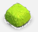
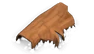
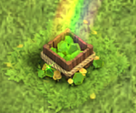
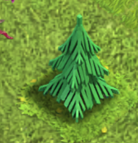
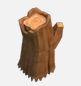

# Vegetation Naming Convention

This document defines the **canonical class names** used for vegetation detection in the
Clash of Clans base-cleaning automation pipeline.

These names must be used **consistently** across:
- Dataset annotation (CVAT)
- YOLO labels
- Inference logic
- Automation scripts

Each class below includes a **reference image** for visual consistency.

---

## 1. Bush

**Class name:** `bush`  
**Description:** Small shrubs occupying 1 tile.

---

## 2. Fallen Trunk

**Class name:** `fallen_trunk`  
**Description:** Horizontal fallen tree trunk occupying multiple tiles.

---

## 3. Gem Box

**Class name:** `gem_box`  
**Description:** Special obstacle that drops gems when removed.

---

## 4. Mushroom

**Class name:** `mushroom`  
**Description:** Small decorative mushroom obstacle.

---

## 5. Tree (Type 1)

**Class name:** `tree_1`  
**Description:** Standard tall tree variant.

---

## 6. Tree (Type 2)

**Class name:** `tree_2`  
**Description:** Alternate tall tree variant.

---

## 7. Trunk (Type 1)

**Class name:** `trunk_1`  
**Description:** Upright tree trunk obstacle.

---

## 8. Trunk (Type 2)

**Class name:** `trunk_2`  
**Description:** Alternate upright trunk variant.

---

## Notes

- Class names are **snake_case**
- Class names are **stable identifiers** (do not rename once training starts)
- Visual variants are separated only if they differ in **shape or footprint**
- If future vegetation types are added, they must be appended here first

---
